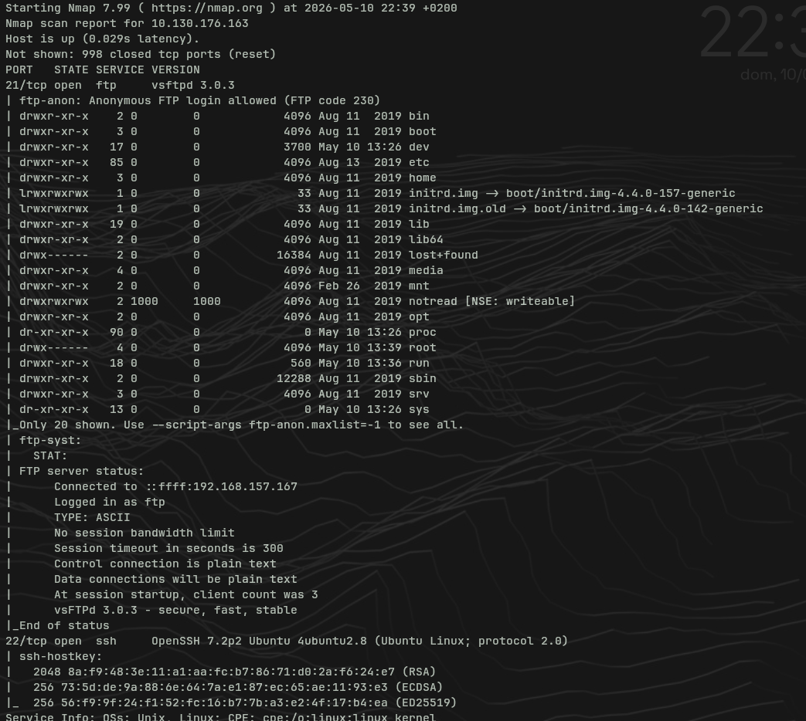
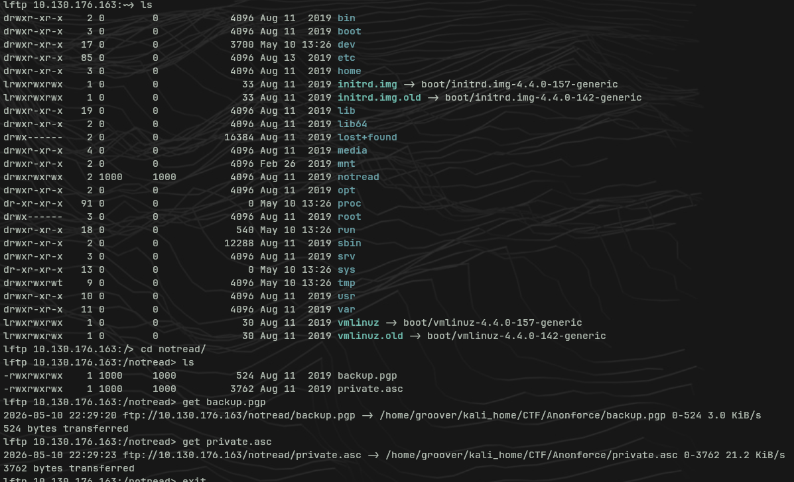
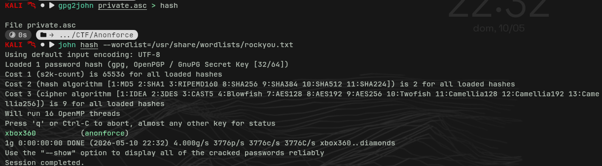
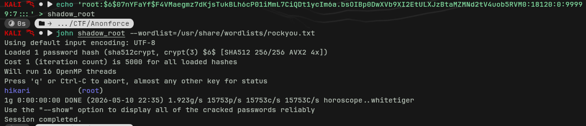
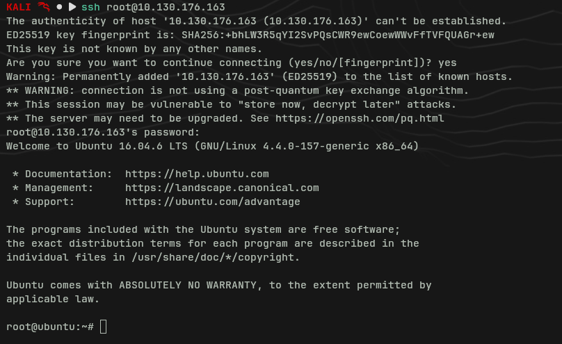

# Anonforce — TryHackMe Writeup

**Platform:** TryHackMe  
**Difficulty:** Easy  
**Category:** Boot2Root  
**Date:** 2026-05-10

---

## Summary

Easy boot2root machine from the BSides Guatemala CTF. Exposes an FTP service with anonymous login that gives access to the full filesystem. Inside, a GPG private key and an encrypted backup are found. Cracking the key with John + rockyou allows decrypting the backup, which turns out to be an `/etc/shadow` dump containing the root hash. Hash cracked → direct SSH access as root.

**Skills covered:** service enumeration, anonymous FTP, GPG/PGP, cracking with John the Ripper, SSH.

---

## Reconnaissance

```bash
nmap -sV -sC -Pn <IP>
```



|Port|Service|Version|
|---|---|---|
|21/tcp|FTP|vsftpd 3.0.3 — **anonymous login allowed**|
|22/tcp|SSH|OpenSSH 7.2p2 Ubuntu|

> **Pentesting note:** Nmap with `-sC` automatically runs the `ftp-anon` script. If anonymous login is enabled, it detects it and lists the root directory. The `notread` folder is already visible in the Nmap output.

---

## FTP — Anonymous Access

```bash
lftp <IP>
```

Login with user `anonymous`, no password required. The FTP exposes the entire root filesystem — a critical misconfiguration (the anonymous user should be jailed to a specific directory, not `/`).



Browsing the filesystem reveals `/notread/`, with `drwxrwxrwx` permissions (world-writable, another red flag):

```
/notread/
├── backup.pgp      # PGP-encrypted file
└── private.asc     # GPG private key
```

Download both files:

```bash
get backup.pgp
get private.asc
```

> **Pentesting note:** Having an encrypted file and its private key in the same location is the equivalent of leaving a lock and its key together. The encryption provides zero security in this scenario.

---

## GPG — Private Key Cracking and Decryption

### 1. Convert the private key to John format

```bash
gpg2john private.asc > hash
```

### 2. Crack the passphrase

```bash
john hash --wordlist=/usr/share/wordlists/rockyou.txt
```



**Passphrase found:** `xbox360`

> **Pentesting note:** `gpg2john` is part of John the Ripper and converts GPG/PGP keys into a hash format that John can process. Protecting a private key with a weak passphrase (present in rockyou) makes the protection trivially bypassable.

### 3. Import the key and decrypt the backup

```bash
gpg --import private.asc
# passphrase: xbox360

gpg --decrypt backup.pgp
```

The decrypted backup turns out to be an `/etc/shadow` dump:

```
root:$6$07nYFaYf$F4VMaegmz7dKjsTukBLh6cP01iMmL7CiQDt1ycIm6a.bsOIBp0DwXVb9XI2EtULXJzBtaMZMNd2tV4uob5RVM0:18120:0:99999:7:::
melodias:$1$xDhc6S6G$IQHUW5ZtMkBQ5pUMjEQtL1:18120:0:99999:7:::
```

|User|Hash type|Identifier|
|---|---|---|
|root|SHA-512|`$6$`|
|melodias|MD5|`$1$`|

---

## Cracking the Root Hash

```bash
echo 'root:$6$07nYFaYf$F4VMaegmz7dKjsTukBLh6cP01iMmL7CiQDt1ycIm6a.bsOIBp0DwXVb9XI2EtULXJzBtaMZMNd2tV4uob5RVM0:18120:0:99999:7:::' > shadow_root

john shadow_root --wordlist=/usr/share/wordlists/rockyou.txt
```



**Root password:** `hikari`

---

## SSH Access — Root

```bash
ssh root@<IP>
# password: hikari
```



Direct access as root. Flags collected from `/home/melodias/user.txt` and `/root/root.txt`.

---

## Flags

|Flag|Location|
|---|---|
|user.txt|`/home/melodias/user.txt` — accessible directly via FTP|
|root.txt|`/root/root.txt` — after compromising root|

---

## What I Learned

- **GPG/PGP in pentesting:** first time working with `gpg2john` + `gpg --import` + `gpg --decrypt`. The flow is: convert the private key to a hash → crack the passphrase → import the key → decrypt the file. A tool to keep in the toolkit for any scenario involving `.pgp`, `.asc`, or `.gpg` files.
- **Identifying hashes in `/etc/shadow`:** the prefix `$6$` indicates SHA-512 (modern), `$1$` indicates MD5 (legacy). Relevant when choosing the right mode in John or Hashcat.
- **Anonymous FTP with access to `/`:** a real-world critical misconfiguration. In an actual engagement, read access to the full filesystem via anonymous FTP is a high-severity finding.
- **Nmap `-sC`:** Nmap NSE scripts (like `ftp-anon`) automate checks that would otherwise be done manually. Always include it during reconnaissance.